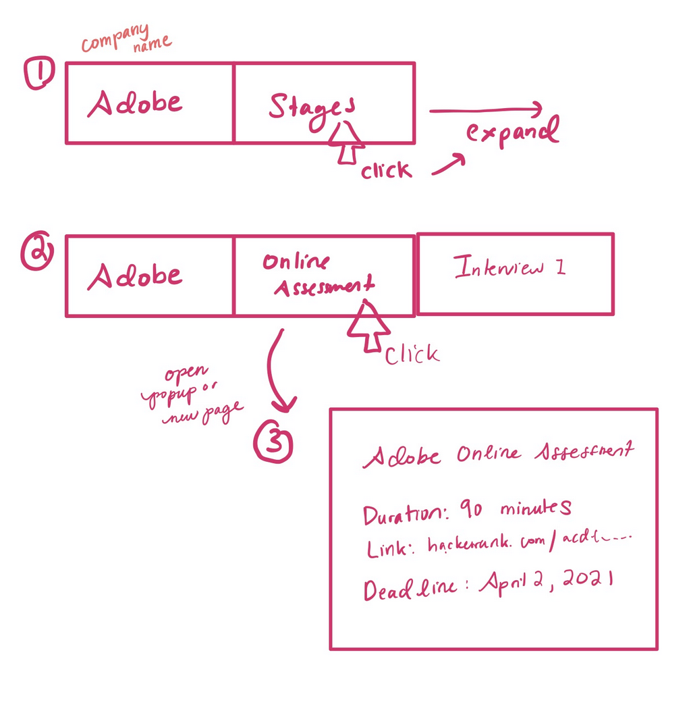

## Project Description

### Target Audience

**JobTracker** is an application for college students who are applying for internships and full-time jobs in the tech industry to help them organize their job applications.

### Why use this application?

Currently, college students use Excel spreadsheets, Google Sheets spreadsheets or [Notion](https://www.notion.so/Job-Applications-e22c1e57d09c48bd9841898daec27d1a) to track their job applications for internships and new grad positions. Updating and maintaining these spreadsheets requires a lot of manual work.

Although templates exist, there is no template that is easily adaptable to the different number and kinds of stages during the application process that a company can have.

For example, some companies have online assessments. Other companies have take-home assignments. Some companies have only 2 interviews, while other have 6. To accommodate these differences, you usually have to manually add new columns to your spreadsheets. This has the problem of creating lots of wasted space for exceptional cases.

**JobTracker** will make it easy to track these various stages. It will also allow users to track other useful information for applying to internships and new grad positions, such as:

- Notes on each stage of the application process

### Why build it?

As university students who are interested in finding full-time jobs after graduation, this is an application we would use. The hunt for internships and new grad jobs is often one of the most stressful periods in a college student’s life. By making this application, we can help ourselves and other college students decrease their stress, save time, and approach the job application process more effectively.

## Technical Description

### User Stories (MVP)

| Priority | User                                 | Description                                                                                                                                 |     |     |
| -------- | ------------------------------------ | ------------------------------------------------------------------------------------------------------------------------------------------- | --- | --- |
| P0       | As a student applying to internships | I would like to track which positions and companies I have applied to, so I can know how many I have applied to and when I applied to each. |     |     |
| P0       | As a student applying to internships | I want to track the URL of the position so I can find the job posting again easily and remember what the position details were.             |     |     |
| P0       | As a student applying to internships | I want to know where I am in the job application process for a company                                                                      |     |     |
| P1       | As a student applying to internships | I want to know deadlines and dates for each stage of the application process so I can make sure I complete each stage on time.              |     |     |
| P1       | As a student applying to internships | I want to keep notes on each stage of the interview process so I can remember my experiences with each stage and learn from them.           |     |     |

### Stretch Goals

- Search by company name, position name
- Organize applications by internship season and year (winter 2021, fall 2021, summer 2022, etc)
- Sort and filter applications by company name, location, etc
- Send email reminders about online assessments so you don’t forget to include them
- Structured interview notes, such as impressions, interview questions, links to the leetcode questions

### Implementation

_As a student applying to internships, I would like to track which positions and companies I have applied to, so I can know how many I have applied to and when I applied to each._

Users can create an account in the web client UI, which sends a POST request to /v1/users and inserts a record in the Users table in a **Postgres DB**. Sessions will be managed by **Redis**, and authentication information will be passed using the Authentication header. Once authenticated, users can add applications and stages of each application, and view and modify this information. When a user visits their home page, a GET request to /v1/users/{UserID} or /v1/users/me endpoint queries the applications **Postgres** table to query all applications for the UserID and returns the records as JSON to the client to be displayed in the UI.

_As a student applying to internships, I want to track the URL of the position so I can find the job posting again easily and remember what the position details were._

The new application creation form will have a positionURL field that will record this information. On POST request to the /v1/applications endpoint, the server will store the application record to the **Postgres** table. When rendering the information for an application, a GET request will be performed on the /v1/applications/{ApplicationID} endpoint to retrieve the record with the URL information.

_As a student applying to internships, I want to know where I am in the job application process for a company_

The data model for a job application has a status field that can be updated by the user from the UI. This will trigger a PATCH request to /v1/applications/{ApplicationID} to update the **Postgres** table. When rendering the information for an application, a GET request will be performed on the /v1/applications/{ApplicationID} endpoint to retrieve the record with the status information.

_As a student applying to internships, I want to know deadlines and dates for each stage of the application process so I can make sure I complete each stage on time._

The application stage data model has a stageDate field to store either an interview date or deadline. Users can enter this information in a form when creating a new stage from the client UI, which will trigger a POST request to the /v1/stages API, and write a record for a stage to the stages **Postgres** database. When a user clicks into an application, this will send a GET request to /v1/applications/{ApplicationID}/stages, which will query all stage records for the ApplicationID from the stages table and display the stage info including the date.

_As a student applying to internships, I want to keep notes on each stage of the interview process so I can remember my experiences with each stage and learn from them._

This will be implemented very similarly to stage dates. In addition to a date field, the Stages table will also have a large varchar column to store freeform notes about the interview.

### Endpoints

### /v1/sessions

Manages CRUD operations for sessions used for user authentication and authorization.

**Handlers**

- SessionsHandler()
- SpecificSessionHandler()

| Endpoint Path     | Functionality   | Method | Statuses                  |     |
| ----------------- | --------------- | ------ | ------------------------- | --- |
| /v1/sessions      | Begin a session | POST   | 201 (Created)             |     |
| /v1/sessions/mine | End a session   | DELETE | 200 (OK), 404 (Not Found) |     |
|                   |                 |        |                           |     |

### /v1/users

Manages CRUD operations for user accounts.

| Endpoint Path                     | Functionality                     | Method | Statuses                                      |     |
| --------------------------------- | --------------------------------- | ------ | --------------------------------------------- | --- |
| /v1/users                         | Put a user into the store         | POST   | 201 (Created)                                 |     |
| /v1/users/{UserID}\*              | Read a user from the store        | GET    | 200 (OK), 401 (Unauthorized), 404 (Not Found) |     |
| /v1/users/{UserID}\*              | Update a user                     | PATCH  | 200 (OK), 401 (Unauthorized), 404 (Not Found) |     |
| /v1/users/{UserID}/applications\* | Read all applications for a user  | GET    | 200 (OK), 401 (Unauthorized), 404 (Not Found) |     |
| /v1/users/{UserID}/applications\* | Put an application into the store | POST   | 201 (Created), 401 (Unauthorized)             |     |

- If UserID = me, perform the operations for the currently authenticated user

**Handlers**

- UsersHandler()
- SpecificUserHandler()

### /v1/applications

Manages CRUD operations for job applications.

| Endpoint Path                    | Functionality                      | Method | Statuses                                      |     |
| -------------------------------- | ---------------------------------- | ------ | --------------------------------------------- | --- |
| /v1/applications/{ApplicationID} | Read an application from the store | GET    | 200 (OK), 401 (Unauthorized), 404 (Not Found) |     |
| /v1/applications/{ApplicationID} | Delete an application              | DELETE | 200 (OK), 401 (Unauthorized), 404 (Not Found) |     |
| /v1/applications/{ApplicationID} | Update an application              | PATCH  | 200 (OK), 401 (Unauthorized), 404 (Not Found) |     |
| /v1/applications/{ApplicationID} | Read all stages for an application | GET    | 200 (OK), 401 (Unauthorized), 404 (Not Found) |     |
| /v1/applications/{ApplicationID} | Put a stage into the store         | POST   | 201 (Created), 401 (Unauthorized)             |     |

**Handlers**

- ApplicationsHandler()
- SpecificApplicationHandler()

### /v1/stages

Manages CRUD operations for application stages.

| Endpoint Path        | Functionality               | Method | Statuses                                      |     |
| -------------------- | --------------------------- | ------ | --------------------------------------------- | --- |
| /v1/stages/{StageID} | Read a stage from the store | GET    | 200 (OK), 401 (Unauthorized), 404 (Not Found) |     |
| /v1/stages/{StageID} | Delete a stage              | DELETE | 200 (OK), 401 (Unauthorized), 404 (Not Found) |     |
| /v1/stages/{StageID} | Update a stage              | PATCH  | 200 (OK), 401 (Unauthorized), 404 (Not Found) |     |

**Handlers**

- StagesHandler()
- SpecificStageHandler()

### Appendix

### Wireframes

### Database Schema

 
Users

This table stores user profiles for every registered user.

| id        | int64, primary key             |
| --------- | ------------------------------ |
| username  | varchar(255), unique, not null |
| email     | varchar(320), unique, not null |
| passHash  | Bytea, not null                |
| firstName | varchar(32), not null          |
| lastName  | varchar(32), not null          |

  
Applications

This table stores the job applications of a registered user.

| id           | int64, primary key           |
| ------------ | ---------------------------- |
| userId       | int64, foreign key, not null |
| positionName | varchar(128), not null       |
| positionURL  | varchar(255)                 |
| company      | varchar(255), not null       |
| location     | varchar(255)                 |
| status       | varchar(32), not null        |
| dateApplied  | timestamp                    |
| dateReplied  | timestamp                    |

  
Stage

This table stores the stages of the application process for a specific application.
For example: Online assessments, recruiter calls, phone interviews, behavioral interviews, coding interviews, system design interviews, take-home assignments

| id            | int64, primary key           |
| ------------- | ---------------------------- |
| applicationId | int64, foreign key, not null |
| stageDate     | timestamp, not null          |
| stageType     | varchar(255), not null       |
| minutes       | int, not null                |
| notes         | varchar(4096)                |

 
ex:

    {
    stageDate: “2021-01-20 10:00:00”,
    stageType: “phoneInterview”
    minutes: “90”
    }

{

stageDate: “2021-01-25 09:00:00”,

stageType: “codingChallenge”

minutes: “60”

}
